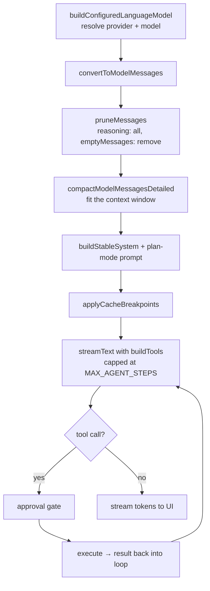

The Nexis AI panel is an agent, not a chat box: it reads files, edits them, runs
commands, searches the codebase, and delegates to subagents. Nearly all of that logic
lives in the **frontend**, built on the [Vercel AI SDK](https://sdk.vercel.ai). Rust
participates in only two roles — HTTP proxy and tool executor.

That split is intentional. Prompt assembly, tool orchestration, and compaction are
product logic that changes weekly; PTY handling and keychain access are not.

For the user-facing feature list, see [AI panel](/features/ai-panel/).

## One turn, end to end

The order of this pipeline is not arbitrary:

**Pruning must precede compaction.** Reasoning blocks from prior turns are stripped
before the history is measured or trimmed. Some providers reject messages containing
them outright, and every other provider silently counts them against the context
budget — so leaving them in makes compaction discard real conversation to make room
for text the model won't use.

**Cache breakpoints go on last**, after the system prompt is assembled, so the stable
prefix is actually stable across turns and providers can serve it from cache.

## Providers

Nexis resolves both cloud providers (OpenAI, Anthropic, Google, Groq, xAI, Cerebras,
DeepSeek, Mistral, OpenRouter, Hugging Face, any OpenAI-compatible endpoint) and
local runtimes (LM Studio, Ollama, vLLM, MLX, SGLang, xLLM). Local endpoints need no
key. See [AI providers](/configuration/ai-providers/) for setup.

All provider HTTP is proxied through Rust, never browser `fetch`. This dodges CORS
entirely, keeps API keys out of webview network state, and puts every outbound
request behind the SSRF and DNS-rebinding checks described in the
[security model](/architecture/security/#outbound-http).

## Tools

The tool registry composes seven families — **fs, edit, search, shell, subagent,
terminal, todo** — all sharing a context object that owns path resolution.
Centralizing path resolution is what lets a single place enforce that the agent can't
wander outside the workspace.

## Tool approval

Every tool call passes an approval gate before it executes. Policies are per-tool,
edited in **Settings → Agents**:

| Policy | Behavior |
|---|---|
| `prompt` | Ask the user every time. **Default.** |
| `auto` | Execute without asking. |
| `deny` | Refuse. |
| `auto-safe` | Shell only — auto-approve if the command passes a strict read-only check. |

`auto-safe` is deliberately paranoid. A command is admitted only if it clears *all*
of: a curated binary allowlist (plus read-only git subcommands), no shell
metacharacters anywhere, and every path argument verified readable — including values
inside `--flag=value` forms and the path half of git's `rev:path` syntax. Anything the
parser can't fully understand is rejected rather than assumed benign.

The design rule throughout is **fail closed**: `auto-safe` configured on any other
tool, or against a non-string command, degrades to `prompt` rather than to `auto`.

## Subagents

Subagents are typed, get read-only filesystem and search tools only, run
non-streaming, and are capped at 12 steps. They receive **a single prompt string with
no message history**, which is why the pruning step above doesn't apply to them.

## Supporting pieces

- **Keyring** — API keys live in the OS keychain; changes broadcast to other windows.
- **Redaction** — secrets are stripped from content that could be surfaced or persisted.
- **Natural-language command bar** — the terminal's AI command bar is **insert-only**.
  Suggestions containing newlines or control characters are rejected, because the
  result is written into the PTY input line where a stray carriage return would
  execute it without the user pressing Enter.

## Further reading

Full detail lives in
[`docs/architecture/ai-subsystem.md`](https://github.com/rwetz/Nexis/blob/main/docs/architecture/ai-subsystem.md).
