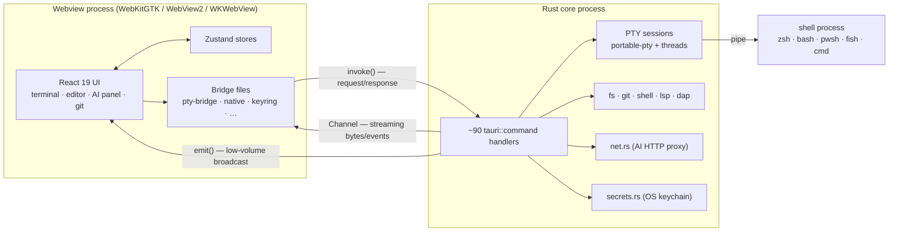
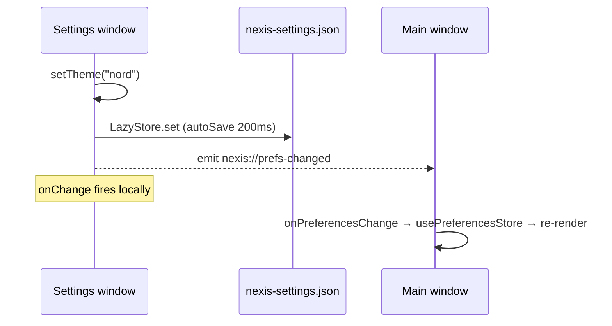

Nexis is a [Tauri 2](https://tauri.app) desktop app, which means it is really **two
processes** with very different privileges. Almost every other design decision in
the app follows from that split, so it's the thing to understand first.

## The two-process model

A **Rust core process** owns everything privileged — PTY sessions, the filesystem,
git, subprocesses, the OS keychain, outbound HTTP. A **webview process** renders
the entire UI in React 19. They talk over Tauri's IPC.

**The webview holds the product logic.** The React app owns UI state, the editor,
the entire AI agent loop, tab management, and the terminal front end. It runs with
no ambient authority: it cannot open a file, spawn a process, or make an arbitrary
network request on its own.

**The Rust core holds the capabilities.** Anything privileged is a command handler.
That concentration is deliberate — it's what makes the
[security model](/architecture/security/) enforceable, because there is a finite,
enumerable list of things the UI can ask for.

## Three ways across the seam

- **`invoke()` — request/response.** The default, for anything one-shot: read a
  file, run a git command, resize a PTY.
- **`Channel<T>` — streaming.** Passed *as an argument* to a command, then written
  to repeatedly by Rust. This is how PTY output reaches xterm.js and how AI tokens
  stream in. Cheap per message; used for anything high-volume.
- **`emit()`/`listen()` — global broadcast.** Every window receives it. Reserved
  for low-volume signals, almost all of them cross-window state sync.

## Multiple windows

The main window is not the only webview. The Settings window and any secondary
windows are **separate webview processes** with their own JS heap, their own
Zustand stores, and their own copy of every hydrated preference.

The consequence: writing a preference to disk does *not* update the other window.
Live sync requires an explicit broadcast, which is why every preference setter
both persists *and* emits a change event.

## What runs where

| Concern | Process | Notes |
|---|---|---|
| Terminal rendering | Webview | xterm.js + WebGL; see [renderer pool](/architecture/terminal/#the-renderer-pool) |
| Terminal PTY, shell process | Rust | `portable-pty`, dedicated threads per session |
| Editor, LSP/DAP clients | Webview | Client protocol logic is TypeScript |
| LSP/DAP server processes | Rust | Process management only |
| AI agent loop, prompts, tools | Webview | Vercel AI SDK; Rust is proxy + executor |
| AI provider HTTP | Rust | Avoids CORS, keeps keys out of the webview |
| API keys | Rust | OS keychain via the `keyring` crate |
| Git | Rust | Shells out to `git` |
| Preferences | Both | Written by either window, synced via event |

## The main-thread rule

**Tauri runs non-`async` commands on the main thread.** While one runs, the event
loop is blocked: the UI freezes, and every queued IPC call — including the
keystroke the user just typed into a terminal — waits behind it. So any command
that touches the filesystem, walks a directory tree, or spawns a process runs on a
blocking-task pool instead.

This is the single most important thing to know before touching the backend.

## Where to go next

- [Terminal internals](/architecture/terminal/) — session lifecycle, thread
  topology, and the renderer pool.
- [AI pipeline](/architecture/ai-pipeline/) — what happens during one agent turn.
- [Security model](/architecture/security/) — workspace authorization and trust
  boundaries.

The canonical, always-current versions of these guides live in
[`docs/architecture/`](https://github.com/rwetz/Nexis/tree/main/docs/architecture)
in the Nexis repo.
