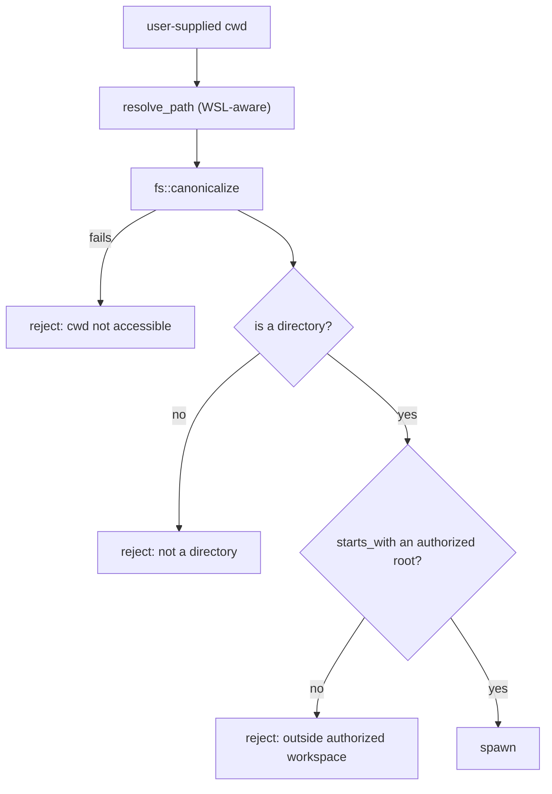

Nexis runs a terminal, an AI agent with tool access, a local HTTP server, and
outbound requests to arbitrary provider endpoints — inside a webview. This page
describes what is trusted, what is gated, and where the boundaries actually sit.

To report a vulnerability, see
[SECURITY.md](https://github.com/rwetz/Nexis/blob/main/SECURITY.md) in the Nexis repo.

## Threat model

What Nexis defends against:

- **Untrusted content rendered in the terminal.** `cat` on a hostile file, output
  from a compromised build, a malicious dependency's install script. Terminal escape
  sequences are an attack surface.
- **The AI agent doing something the user didn't sanction** — reading outside the
  workspace, running a destructive command, exfiltrating secrets — whether from
  prompt injection in a file it read or from a provider misbehaving.
- **The webview reaching the local network or cloud metadata endpoints**, directly or
  via a redirect or rebinding trick against a user-supplied provider URL.
- **Secrets landing somewhere durable** — on disk, in a log, in a crash report.

What is explicitly *not* in the model: a user who deliberately runs a malicious
command in their own terminal. Nexis is a terminal; running commands is the product.
The gates exist to ensure the *user* decided, not that the command is safe.

## The capability boundary

The webview has no ambient authority. It can't open a file, spawn a process, or make
a network request except by asking the Rust core, and the core exposes a finite,
enumerable list of commands. This is the foundation everything else builds on — see
the [two-process model](/architecture/#the-two-process-model).

Tauri's capability system narrows it further, granting a specific permission set to
specific window labels. The webview also runs under a restrictive CSP: `object-src
'none'`, `base-uri 'self'`, `form-action 'self'`, and a `connect-src` limited to IPC,
`api.github.com`, and localhost — meaning injected script in the webview cannot
exfiltrate to an arbitrary host. There is no `unsafe-eval` and no CDN origin.

## Workspace authorization

Every user-supplied path that will become a process's working directory passes an
authorization check:

**Canonicalization is the step that matters** — it defeats `..` traversal and symlink
escape, since both are resolved before comparison.

The registry bootstraps with two roots: the launch directory and the user's home.
Anything else must be explicitly authorized, and authorization canonicalizes before
inserting — so authorizing a symlink registers its target, not the link.

A canonicalization cache with a **1-second TTL** coalesces the burst of calls a single
panel refresh generates. The TTL is short on purpose: it bounds the time-of-check /
time-of-use window rather than letting a stale positive persist.

## Subprocess construction

All non-PTY subprocesses are built through one sanctioned constructor, which
pre-applies `CREATE_NO_WINDOW` on Windows. This started as a cosmetic fix for console
flashes and turned out to be a correctness fix too — an unflagged spawn can corrupt a
live ConPTY session, silently killing output in the active terminal.

## AI tool approval

The agent's capabilities are gated per tool call, defaulting to `prompt` — nothing
runs without the user seeing it. Full treatment in the
[AI pipeline](/architecture/ai-pipeline/#tool-approval).

## Secrets

API keys go to the **OS keychain** via the `keyring` crate. They are never written to
the preferences store, never persisted to disk by Nexis, and never handled by browser
`fetch` — provider requests are proxied through Rust specifically so keys don't enter
webview network state.

The secrets, network, and recording modules are compiled with lints that fail CI on a
new `.unwrap()` or `.expect()`. A panic in a secrets or network path is a security
event, not just a crash.

## Outbound HTTP

Provider endpoints are user-configurable, which makes them an SSRF vector — a
"provider URL" of `http://169.254.169.254/` would otherwise turn the app into a
cloud-metadata proxy. The defenses layer up:

- **URL validation** rejects non-HTTP schemes, URLs carrying userinfo, and known-bad
  metadata hostnames.
- **IP classification** sorts resolved addresses into public / private / loopback /
  blocked, and is conservative about IPv4 reserved space — CGNAT, benchmarking, and
  other reserved ranges are never classified public.
- **DNS rebinding defense.** Validating a hostname and then letting the HTTP client
  resolve it again invites a second lookup returning a different address. Nexis
  resolves once, classifies those addresses, and pins the resolution for the actual
  request, so the checked IP is the connected IP.
- **Header sanitization** blocks hop-by-hop headers and rejects CRLF injection.

Loopback and private destinations are permitted only where a caller explicitly opts
in — that's how local model runtimes work at all. The allowance is per-call, not
global.

## Terminal escape sequences

Terminal output is untrusted input. Two sequences get specific treatment:

**OSC 52 (clipboard).** Reads are consumed silently and unconditionally — a program
that can print escape sequences must never be able to exfiltrate the clipboard.
Writes are gated behind a preference, off unless the user opts in.

**OSC 7 (working directory).** Rejected while a command is running, because
in-command output is attacker-controllable and a spoofed cwd would redirect the
user's next tab or the git panel. The gating relies on OSC 133 command-state markers,
and a rejected report deliberately does not mark shell integration as present —
otherwise hostile output could flip the app into disabling its fallback path.

## The share server

Terminal sharing serves a **read-only** live view over the LAN. Every route is
token-gated with a constant-time comparison, the bind address is caller-chosen rather
than defaulting to all interfaces, and the viewer cannot send input.

## Privacy

No telemetry, of any kind. Diagnostics export is user-initiated and produces a local
zip. Private terminals are excluded from AI context and are not serialized into
session snapshots.

## Verification

Security-relevant invariants are enforced by the build, not by convention: tripwire
tests assert subprocess-constructor confinement, the ConPTY lifecycle lock,
authorization usage, and input-ordering guarantees; lint rules ban the raw subprocess
constructor and panics in security paths; and CI blocks high-severity advisories in
shipped dependencies.

## Further reading

Full detail lives in
[`docs/architecture/security-model.md`](https://github.com/rwetz/Nexis/blob/main/docs/architecture/security-model.md).
