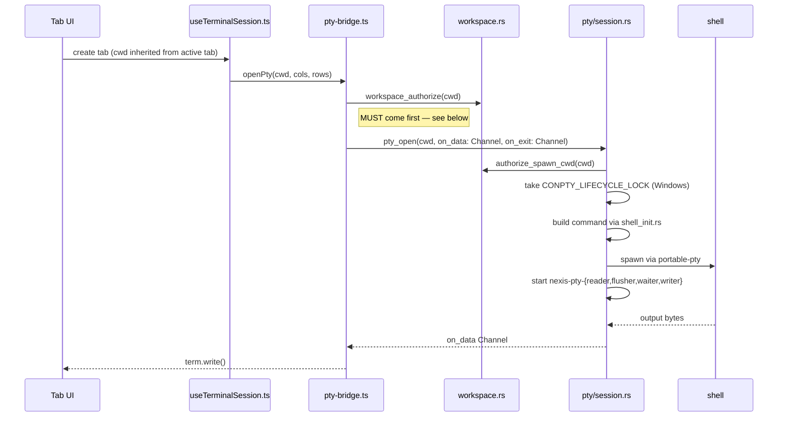
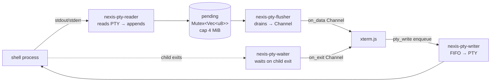
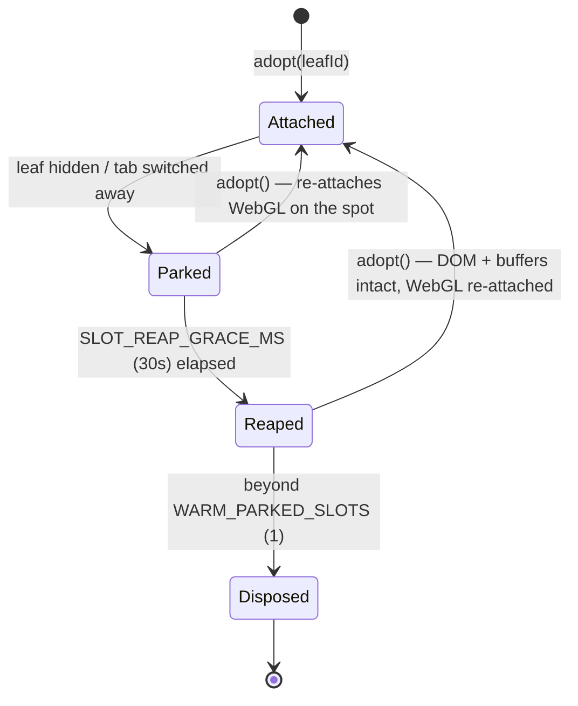

The terminal is the oldest and densest subsystem in Nexis. This page covers how a
keystroke becomes a byte in a shell, how the shell's output becomes pixels, and why
40 open tabs don't cost 40 WebGL contexts.

For the user-facing feature list, see [Terminal](/features/terminal/).

## Opening a session

**The authorization step is load-bearing.** Opening a PTY calls
`authorize_spawn_cwd`, which rejects any working directory not under an authorized
workspace root — so the frontend pre-authorizes before it asks. See
[workspace authorization](/architecture/security/#workspace-authorization).

## Thread topology

Each session runs four named threads (`nexis-pty-*`, greppable in logs) around one
shared buffer:

**Why a flusher at all:** reading and forwarding on the same thread would send one
IPC message per read syscall. The flusher coalesces bursts into batches — the
difference between a smooth `cat bigfile` and a stuttering one.

**Backpressure.** The `pending` buffer is capped at 4 MiB. If xterm.js falls behind
— a hidden pane, a firehose of output — the buffer fills and is *discarded* with a
visible `[nexis: dropped output due to backpressure]` notice. This is intentional;
the alternative is unbounded growth and an out-of-memory crash.

**Input ordering.** Input has exactly one guarantee to preserve: bytes arrive in the
order the user typed them. Writes are therefore enqueue-only onto a FIFO that a
per-session writer thread drains, rather than written inline (which would freeze the
app whenever the child stops reading) or dispatched to a thread pool (where two
rapid keystrokes can race).

## Shell integration

A raw PTY gives you bytes. Shell integration gives you *structure* — where the
prompt is, which bytes were a command versus its output, what the working directory
is, and whether the command failed. Nexis injects a small profile script per shell
that emits OSC escape sequences.

| Sequence | Meaning | Used for |
|---|---|---|
| OSC 7 | current working directory | tab titles, new-tab cwd inheritance, git panel |
| OSC 133 A/B/C/D | prompt / command / output / exit code | exit-status gutter, command boundaries, failure detection |
| OSC 0 / 2 | window title | live tab titles |
| OSC 52 | clipboard | **write-only**, preference-gated |

Two of these are also security boundaries — see
[terminal escape sequences](/architecture/security/#terminal-escape-sequences).

**When integration is missing.** Not every shell cooperates — an unusual shell, a
profile that clobbers the injection, a remote session. If no marker arrives within
about five seconds, Nexis falls back to polling the working directory directly
(Linux only). That rescues cwd tracking; the exit-status gutter and the failed-command
"✦ Explain" chip have no fallback.

## The renderer pool

A naive terminal app creates one xterm.js instance per tab and keeps it forever.
That has a measurable cost: every instance holds its scrollback buffers, a full DOM
subtree, and a live WebGL context with its own texture atlas — for the entire
session, whether or not anyone can see it.

Instead, Nexis owns a bounded set of **slots** (max 5). A slot is a real xterm.js
terminal plus its addons, *rented* to a terminal pane rather than owned by it:

The crucial decoupling: **a PTY session is not a slot.** The shell keeps running and
its output keeps arriving regardless of whether a renderer is attached. A pane
without a slot isn't a dead terminal — it's a live terminal nobody is looking at.

- **Attached.** Visible, WebGL on, receiving writes.
- **Parked.** Not rendered, but the instance, DOM, and buffers are kept so
  re-adoption is instant. A 30-second grace timer starts.
- **Reaped.** The slot drops its WebGL context and falls back to the DOM renderer.
  For something invisible this costs nothing perceptible, and it buys back the
  texture atlas memory plus fewer idle GL contexts — fragile drivers raise
  context-loss events roughly in proportion to how many are live.

Adoption re-attaches WebGL immediately, so switching back to a long-idle tab doesn't
leave you on the slow renderer.

**Tab count is not capped at five.** Tabs are unlimited; five is how many can be
*rendered* concurrently, which in practice exceeds any realistic split layout.

## Scrollback across restarts

Terminals survive app restarts. On exit, each non-private terminal's active pane is
serialized (capped at 5000 lines) and written atomically to the cache directory. On
restore, the snapshot load is chained into session startup **before** the PTY opens —
that ordering is what guarantees the replayed scrollback lands ahead of the first
byte from the new shell rather than interleaving with it.

Private terminals are excluded by design; they aren't serialized at all.

## Further reading

Full detail lives in
[`docs/architecture/pty-shell-integration.md`](https://github.com/rwetz/Nexis/blob/main/docs/architecture/pty-shell-integration.md)
and
[`terminal-renderer-pool.md`](https://github.com/rwetz/Nexis/blob/main/docs/architecture/terminal-renderer-pool.md).
