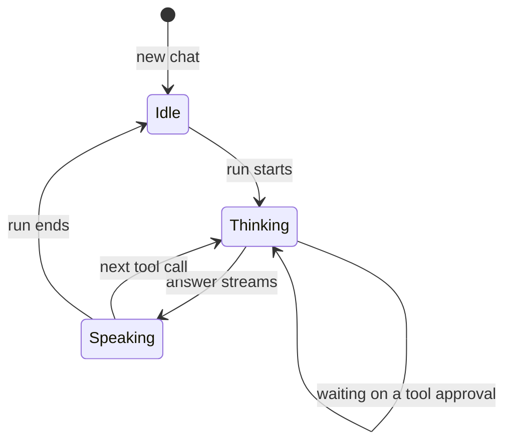

import { Kbd } from 'starlight-kbd/components';
import Screenshot from '../../../components/Screenshot.astro';
import aiShot from '../../../assets/ai.png';

The AI panel is a dockable assistant that shares your workspace context. Toggle
it any time with <Kbd linux="ctrl+i" mac="cmd+i" windows="ctrl+i" />.

<Screenshot src={aiShot} alt="The Nexis AI panel showing an agentic workflow with edit diffs" caption="The AI panel running an agentic workflow, with proposed edits shown as diffs in the editor." />

## Providers — or none at all

- **12+ cloud providers** — OpenAI, Anthropic, Google, Groq, xAI, Cerebras,
  DeepSeek, Mistral, OpenRouter, Hugging Face Inference API, and any
  OpenAI-compatible endpoint.
- **Fully offline** — LM Studio, MLX, and Ollama, with no API key required.

Configure them under **Settings → AI → Models**. See [AI providers](/configuration/ai-providers/)
for the full list and setup. Keys are saved through the **OS keychain**, not in Nexis settings files.

## Agents and tools

- **Multi-agent and sub-agents** with tool approval flows.
- **Agent queue** — queue follow-up tasks while an agent runs; they execute in
  order. Stop queued or running tasks from the **Activity** panel.
- **Tool strip** — the AI window holds **Chat, Queue, Refactor, Templates and
  Review**. Handing work to the agent is a tab switch in the same window, and
  Chat stays mounted underneath, so a streaming reply survives a look at the
  queue.
- **File, shell, search, and plan tools** — governed by per-tool prompt, deny,
  allow, or read-only auto-approval policies.
- **Custom TypeScript tools** — scaffold workspace-specific agent capabilities
  without modifying Nexis itself.
- **Slash commands and skills**, plus **prompt templates** with `{VAR}`
  placeholder substitution.
- **Semantic search** — embed and search codebase symbols and docs so the AI
  retrieves the right context.
- **Voice input** — Whisper transcription via OpenAI.
- **Auto-compaction** keeps long conversations within the context window.

## The orb

The new-chat card shows an animated **orb**, and while the agent works the
"Thinking…" spinner becomes a small orb that follows the whole run. Pick one of
**26 styles** under **Settings → AI → Orb**, with a live preview and gallery. Ten
styles follow the theme's colours (marked with a Theme chip); sixteen keep a
signature palette.

States ease into each other rather than switching. Orbs are original WebGL2
shaders, so they run on every platform Nexis ships on. Without WebGL2 the orb
falls back to a CSS disc, reduced motion draws one settled frame, and loops stop
while the window is hidden or the orb is scrolled away.

## Transparency

- **AI context inspector** — a panel that shows exactly what context is sent to
  the model.
- **Private terminals** — the AI cannot read their scrollback.
- **Project memory** — drop a `NEXIS.md` in your project root and the AI
  remembers your conventions across sessions.
- **Git-backed checkpoints** — revert one agent turn without discarding other
  worktree changes.

## Terminal ↔ AI

- Select terminal output and click **Ask Nexis** or **Explain** to send it
  straight to the chat.
- **Inline explain** — select any terminal output or code and click **Explain**;
  the answer appears in a mini window without disrupting your flow.
- **Explain commit** — click a commit in git history for a plain-English
  breakdown of what changed and why.

The panel is **dockable** — resize, float, and snap it back to the dock.
