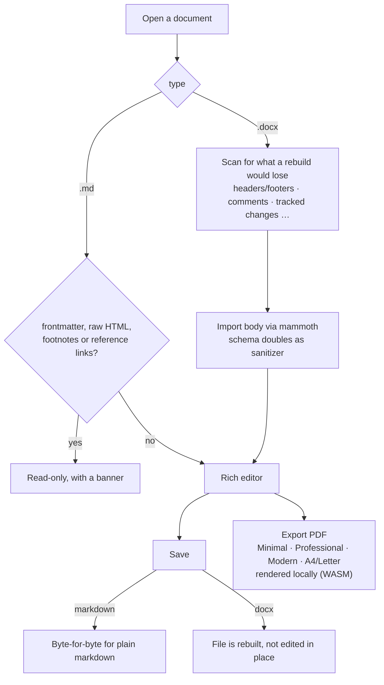

import Screenshot from '../../../components/Screenshot.astro';
import editorShot from '../../../assets/editor.webp';
import spotlightShot from '../../../assets/spotlight.webp';
import markdownShot from '../../../assets/markdown.webp';
import documentsEditorShot from '../../../assets/documents-editor.webp';

Nexis includes a full code editor built on **CodeMirror 6**, sharing the window
with your terminal so you can edit and run without switching apps.

<Screenshot src={editorShot} alt="Nexis — A TypeScript file in the editor, with breadcrumbs and the minimap" caption="A TypeScript file in the editor, with breadcrumbs and the minimap." />

## Languages and syntax

Syntax highlighting covers TS/JS, Rust, Python, HTML/CSS, JSON/JSONC, Markdown,
Go, C/C++, Java, C#, PHP, Ruby, SQL dialects, YAML, TOML, Shell/Bash, and
Dockerfile.

## AI in the editor

- **Inline autocomplete** — context-aware completions with a configurable
  provider and model.
- **Diff approval** — AI-proposed edits are shown as **per-hunk diffs**; approve
  or reject each change individually. Nothing is written until you say so.
- **Agent checkpoints** — each agent change can create a Git-backed checkpoint
  that reverts only that turn without disturbing unrelated work.

## Refactoring and navigation

- **Semantic symbol rename** (<kbd>F2</kbd>) — LSP-powered rename across the
  project when a language server is running, so only true references change. When
  no server is available, it falls back to a word-boundary find/replace with a
  preview dialog.
- **LSP refactorings** (<kbd>Ctrl+Shift+R</kbd>) — extract function and inline
  variable via language-server code actions. Every affected open tab reloads
  instantly.
- **Breadcrumbs** — file path plus symbol crumbs at the top of the editor.
- **Symbol outline** — a file-level function/class/variable tree in the sidebar.
- **Spotlight** (<kbd>Ctrl/Cmd+P</kbd>, or the title-bar search button) —
  finds files *and* commands. At rest it is a compact pill of recent files; type
  and it widens into results plus a live preview (image thumbnails, a small code
  window, text excerpts, file details). Subsequence ranking means `mtx` finds
  `modules/terminal/index.ts`. Opening a result uses the explorer's routing, so
  images open in the image viewer and markdown in its preview.
- **Find and replace across the project** — workspace-wide regex search with
  per-file preview and confirmation.

<Screenshot src={spotlightShot} alt="Nexis — Spotlight ranks by subsequence, so mtx finds modules/terminal/index.ts" caption="Spotlight ranks by subsequence, so &quot;mtx&quot; finds modules/terminal/index.ts." />

## Editing niceties

- **Code minimap** with line-type coloring, click-to-scroll, and a viewport
  indicator.
- **Vim mode**.
- **Inline linting** — real-time syntax error markers (Lezer-based) for JS/TS,
  Python, Rust, Go, JSON, HTML, CSS, and Markdown.
- **Formatting** — Prettier, rustfmt, clang-format, black, gofmt, and more;
  configurable per language, on save or with <kbd>Shift+Alt+F</kbd>.
- **Code folding** — by indent, region comments, and language constructs.
- **Word wrap** — per-file and global toggles.
- **Snippet library** — tab-stop snippets scoped by language.
- **Run current file** — execute via a configured command, with output captured
  in a terminal tab.

## Viewers

- **Markdown preview** — right-click a `.md` file → **Open Preview**. Its
  **Edit** button opens the rich editor (Documents pack).
- **Jupyter notebook viewer** — right-click any `.ipynb` to open a **static**
  viewer for code, markdown, stream, and error outputs. It does not run cells.

<Screenshot src={markdownShot} alt="Nexis — Markdown preview, with the Edit button that opens the rich editor" caption="Markdown preview, with the Edit button that opens the rich editor." />

## Documents

The **Documents** pack (Settings → Features → Documents) adds rich-text editing
for `.md`, `.markdown` and `.docx` files, in its own window with a filterable
file list and a strip of open documents.

<Screenshot src={documentsEditorShot} alt="Nexis — The Documents window" caption="The Documents window: workspace documents on the left, the rich editor on the right." />

- Plain markdown saves back byte for byte; tables keep their cells.
- Word files are **rebuilt** on save, so Nexis warns up front about anything the
  rebuild would drop.
- PDF export runs locally; linked images are written as alt text and URL rather
  than fetched.
- Limitations: document tabs aren't restored after a restart, an open document
  doesn't reload when the file changes on disk, and PDF export is toolbar-only.

## Live sync

The editor and explorer update from a native filesystem watcher as files change
on disk, so external tools and the AI stay reflected without polling.
