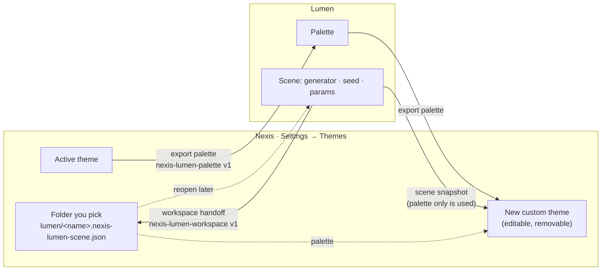

Nexis is highly themeable — from the editor palette down to the terminal colors
and the file-explorer icons.

## Built-in themes

Nexis ships **22 built-in themes**, all with light and dark variants:

- **17 Nexis palettes:** Nexis Default, Halcyon, Meridian, Cinder, Aurelian,
  Thicket, Vermillion, Hotwire, Tangerine, Sulfur, Acid, Absinthe, Cyanotype,
  Glacier, Ultramarine, Ultraviolet, and Synthwave.
- **5 credited community palettes:** Tokyo Night, Catppuccin, Nord, Gruvbox,
  and Rosé Pine.

The Nexis palettes share one generated OKLCH lightness ramp and build-enforced
contrast floors. File-tree icons retint onto the active terminal palette, while
brand-logo fallbacks keep their original colors.

Nexis Default also has an optional rainbow hover accent under **Settings →
Themes**. It colors eligible icon/text marks and the live AI aurora, not whole
button surfaces. It is deliberately quiet and leaves file-type icons alone,
since their colours say what kind of file it is.

## Type

The interface is set in **Geist** and code, the terminal and `--font-mono` in
**Geist Mono**, both as variable fonts so every terminal weight renders
properly. **Space Grotesk** is used only where Nexis speaks in its own voice:
dialog titles, empty states, section headers and the welcome wordmark.

## High contrast

**Settings → General → Contrast**: System, Standard or High (or the "Toggle high
contrast" command). It works on top of any theme: muted text, borders and hover
surfaces are re-derived from the theme's own colours, so each theme keeps its
character. Muted text clears WCAG AAA, borders clear 3:1, and focus is always a
visible 2px outline.

## Custom themes

- Create, import, and delete **`.nexis-theme`** files.
- A **live swatch preview** shows colors as you pick them.
- The **theme editor** opens any `.nexis-theme` directly in the code editor, so a
  theme is just a file you can version and share.

## Lumen palettes and scenes

Nexis exchanges colours with [Lumen](https://github.com/rwetz/lumen), the WebGL
wallpaper generator, through small versioned JSON files. There is no background
sync; every exchange is a file you choose.

- Importing creates a **new** custom theme (first colour → background, second →
  accent, text chosen for contrast). Delete the theme to undo the import.
- A workspace handoff asks you to pick the destination folder and never
  overwrites an existing scene. A path inside the JSON never authorizes a
  workspace.
- Nexis never runs the Lumen scene; animation state, PTYs and credentials never
  cross the boundary. Unknown format versions are rejected.

## Backgrounds

Set a **background image** with adjustable **opacity** (0–100%) and **blur**
(0–64 px) for a personalized workspace.

## Icon themes

The file explorer supports **Catppuccin** and **Material** icon themes, with a
`vscode-icons` fallback so ecosystem folders (NuGet, Maven, Kotlin, iOS, Flutter,
MongoDB, and more) still get purpose-built art.

## Configuring

Themes are set under **Settings → Themes**. See
[configuration → themes](/configuration/themes/) for details on authoring your
own.
