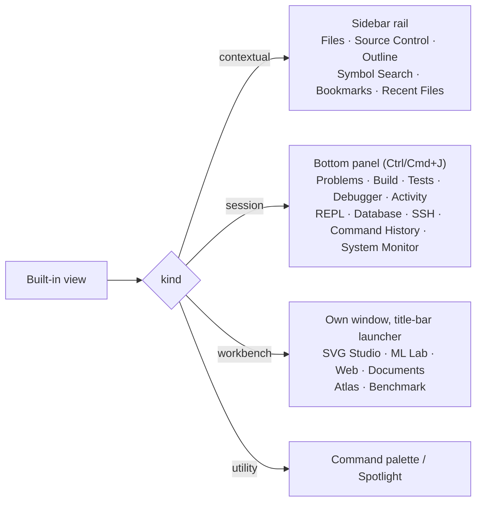
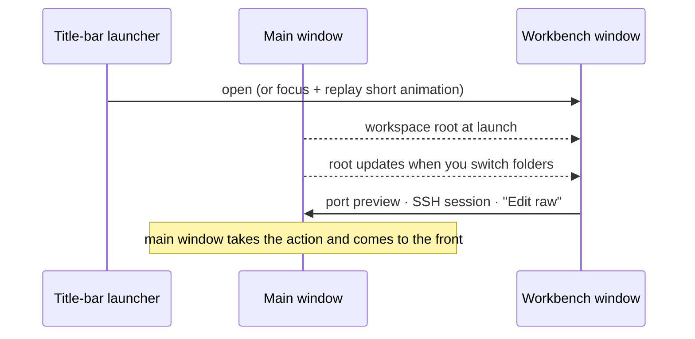

import Screenshot from '../../../components/Screenshot.astro';
import featuresShot from '../../../assets/features.webp';
import bottomPanelShot from '../../../assets/bottom-panel.webp';
import atlasShot from '../../../assets/atlas.webp';
import svgStudioShot from '../../../assets/svg-studio.webp';
import webToolsShot from '../../../assets/web-tools.webp';
import svgPaletteShot from '../../../assets/svg-palette.webp';
import webShot from '../../../assets/web.webp';
import documentsShot from '../../../assets/documents.webp';

Nexis keeps the terminal, editor, Files, Recent Files, Source Control and AI chat
available at all times. Everything else is organized into **feature packs**.
Turning a pack off hides its surfaces; it does not uninstall code.

## Presets

Presets are one-click bundles over the same toggles in **Settings → Features**:

<Screenshot src={featuresShot} alt="Nexis — Settings → Features" caption="Settings → Features: presets on top, individual packs below." />

| Preset | Intended surface |
| --- | --- |
| Bare-Bones | Terminal, editor, files, source control, and AI chat. |
| Standard | Core plus navigation, build/test/debug, and developer tools. |
| Web Dev | Standard plus the Web workbench (Ports, HTTP Client, Web Tools). |
| Mobile | Standard plus the Mobile pack; its Expo/React Native panels are still planned. |
| AI / ML | Standard, AI Extras, ML Lab, and Benchmark. |
| Art | Files, source control, and SVG Studio without code-reading panels. |
| Everything | Every currently available pack, including Documents. |

The first-run tour and lasting Getting Started checklist derive from the active
packs, so changing your configuration also changes the guidance.

## Where a surface lives

Every built-in view has a *kind*, and the kind decides its home. The sidebar
rail no longer holds 34 pinnable views; it holds the six you glance at while
working on a file.

<Screenshot src={bottomPanelShot} alt="Nexis — The bottom panel holds session views; here, System Monitor" caption="The bottom panel holds session views; here, System Monitor." />

- **Sidebar rail** — contextual panels for the file in front of you.
- **Bottom panel** — things you start, watch run and see finish. It toggles with
  <kbd>Ctrl/Cmd+J</kbd> or the **Panel** button in the status bar.
- **Workbenches** — places you go and stay.

## Workbench windows

SVG Studio, ML Lab, Web and Documents each open in **their own window**, like
Atlas and Benchmark. A window can sit on a second screen beside the code.

- The launchers sit in **one row**; drag one to reorder it. The order is saved
  (`titlebarToolOrder`), and a launcher whose pack is off keeps its place.
- A window is capped to 92% × 90% of the monitor's work area when it opens.
- Opening eases the window in; reduced motion turns this off.
- Atlas has its own map icon; Web keeps the globe.

## The workbenches

- **Atlas** — an isometric map of your repos, with a 53-week commit-activity
  heatmap per repo read from local git history.
- **Benchmark** — compares ONNX and GGUF models across CPU-only ONNX Runtime,
  llama.cpp, nexis-ml-rs, and a clearly labelled simulated backend.
- **ML Lab** — local training and experiments. A running job shows an elapsed
  clock and a stop button.
- **SVG Studio** (Art pack) — Draw (source, canvas, shapes, 27 presets, preview)
  plus Palette, Backdrop, Icon Set, Favicon Set and Animator in one tool strip.
  Presets and shapes *add* to the canvas by default, each in its own slot.
- **Web** (Web Dev pack) — Ports, an SSRF-guarded HTTP Client, and Web Tools
  (JSON, JWT, codecs, regex). Each tool is gated by its own pack.
- **Documents** (Documents pack) — rich-text editing for Markdown and Word files
  with PDF export. See [Editor → Documents](/features/editor/#documents).

<Screenshot src={atlasShot} alt="Nexis — Atlas" caption="Atlas: every repo it is configured to scan, with branch, changes and a commit heatmap." />

<Screenshot src={svgStudioShot} alt="Nexis — SVG Studio's Backdrop tool generating layered waves" caption="SVG Studio's Backdrop tool generating layered waves." />

<Screenshot src={svgPaletteShot} alt="Nexis — SVG Studio's Palette tool" caption="SVG Studio's Palette tool, whose colours feed Backdrop." />

<Screenshot src={webShot} alt="Nexis — The Web window's HTTP Client" caption="The Web window's HTTP Client, with Ports and Tools in the same strip." />

<Screenshot src={webToolsShot} alt="Nexis — The Web window's Web Tools formatting JSON" caption="The Web window's Web Tools formatting JSON." />

<Screenshot src={documentsShot} alt="Nexis — The Documents window before a document is opened" caption="The Documents window before a document is opened." />

## Long-running work

A shared chip (live dot, name, elapsed clock, stop control) shows running work
the same way everywhere: the oldest background process in the status bar, ML Lab
training, and Benchmark sweeps.

## Command history and privacy

Command recording is **off by default**. If enabled, the Command History panel
adds success-filtered history, searchable captured output, build-time trends,
and a local work journal. **Settings → Privacy** shows what is stored, controls
age/count/output caps, and provides time-windowed or whole-workspace deletion.
